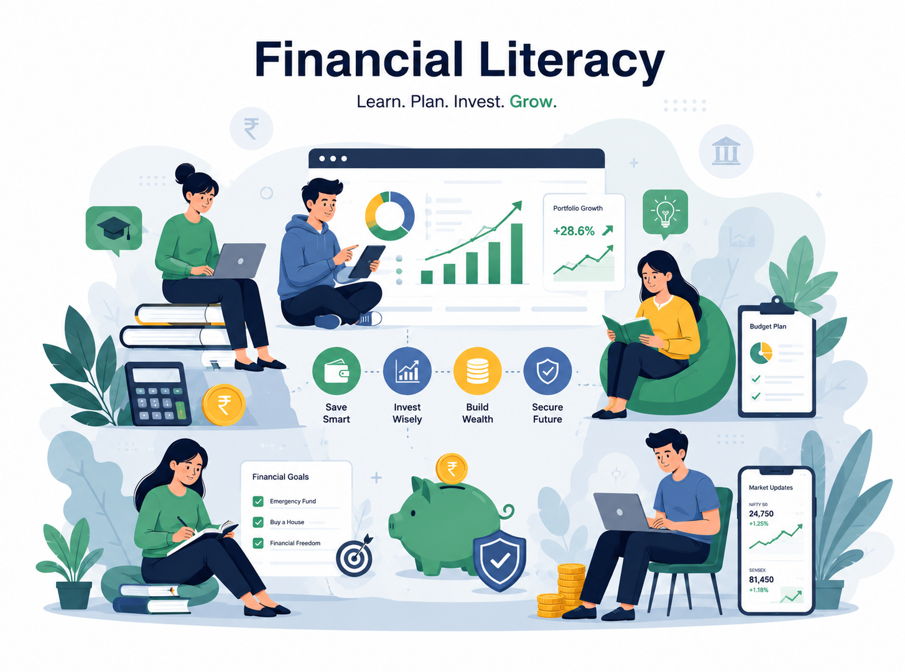

<div align="center">


# 🎓 FinLearn Academy
### Financial Literacy Hub

**A Gamified, Full-Stack Educational Ecosystem for Modern Finance**

[](https://react.dev/)
[](https://expressjs.com/)
[](https://mongodb.com/)
[](https://mui.com/)
[](https://tailwindcss.com/)

[🚀 Live Demo](#) · [📖 Documentation](#) · [🐛 Report Bug](#) · [✨ Request Feature](#)

---

</div>

## 📌 Table of Contents

- [Project Overview](#-project-overview)
- [Core Features](#-core-features)
- [Tech Stack](#-tech-stack)
- [Getting Started](#-getting-started)
- [Project Structure](#-project-structure)
- [Database Schema](#-database-schema)
- [Security](#-security)
- [Screenshots](#-screenshots)
- [Future Roadmap](#-future-roadmap)
- [Troubleshooting](#-troubleshooting)
- [Team & Academic Info](#-team--academic-info)

---

## 🚀 Project Overview

**FinLearn** bridges the financial literacy gap through an engaging, bite-sized learning experience. Unlike traditional LMS platforms, FinLearn combines a **gamification engine** with personalized curriculum delivery — rewarding learners with XP, streaks, and verifiable certificates.

### 🎯 Core Pillars

| Pillar | Description |
|--------|-------------|
| 🧭 **Personalized Onboarding** | Cinematic 7-step flow tailors curriculum to your experience level and goals |
| 🏆 **Gamified Learning** | Real-time XP, leaderboards, and daily streaks drive engagement |
| 🔒 **Verified Certificates** | Public verification system with SEO-optimized LinkedIn sharing |
| ⚙️ **Account Control Hub** | Centralized settings for security, regional preferences, and notifications |

---

## ✨ Core Features

### 🛠️ Advanced Profile & Settings Hub
A unified management console with Framer Motion–powered tabbed transitions:
- **Live Profile Updates** — Real-time avatar preview with base64 image uploading
- **Security Center** — Password management with field-level visibility toggles; 2FA placeholder
- **Notification Granularity** — Categorized toggles (Learning Activity, Financial Insights, Marketing)
- **Regional Customization** — Multi-currency (INR, USD, etc.) and localized timezones

### 🧭 Intelligent Onboarding (7 Steps)

```
Experience Level → Goal Mapping → Time Commitment → Learning Style
→ Current Situation → Priority → Path Preview
```

- 🌱 Beginner to 🧠 Advanced experience selection
- Multi-select goal mapping (Wealth Building, Debt Freedom, etc.)
- Instant preview of your first 3 curated modules

### 🏆 Gamification Infrastructure
- **`useRealtimeXP` Hook** — Memory-leak-safe polling keeps XP/levels in sync with the server
- **Dynamic Leaderboard** — Global rankings + current user position, auto-fetched
- **Modular Progress** — `courses.js` handles per-lesson completion, module unlocking, and XP rewards

### 🔒 Enterprise-Grade Backend
- **Resilient MongoDB** — Graceful `SIGINT` shutdown + automated connection monitoring
previews on LinkedIn
- **Seedable Demo Data** — One command populates the DB with full course data for dev/QA

---

## 💻 Tech Stack

### Frontend

| Technology | Purpose |
|-----------|---------|
| React 19 | UI Framework |
| Material UI v6 | Component Library |
| Tailwind CSS v4 | Utility Styling |
| Bootstrap 5 | Grid System |
| Framer Motion 12 | Animations & Transitions |
| Custom Hooks + Context | State Management |
| Fetch API Abstraction | Data Fetching |

### Backend

| Technology | Purpose |
|-----------|---------|
| Node.js + Express | Server Runtime |
| MongoDB + Mongoose | Database & ODM |
| Passport.js (Google OAuth 2.0) | Authentication |
| JWT (HttpOnly Cookies) | Session Management |
| Bcrypt | Password Hashing |
| Nodemailer | Email Service |

---

## 🚀 Getting Started

### Prerequisites

- Node.js v18+
- MongoDB (local or Atlas)
- Google Cloud Console project (for OAuth)

### 1. Clone the Repository

```bash
git clone https://github.com/your-username/finlearn-academy.git
cd finlearn-academy
```

### 2. Environment Configuration

Create a `.env` file inside the `server/` directory:

```env
# Database
MONGO_URL=your_mongodb_connection_string

# Auth
ACCESS_TOKEN_KEY=your_jwt_secret_key
REFRESH_TOKEN_KEY=your_refresh_secret_key

# Google OAuth
GOOGLE_CLIENT_ID=your_google_client_id
GOOGLE_CLIENT_SECRET=your_google_client_secret

# Email
MAIL_USER=your_gmail_address
MAIL_PASSWORD=your_gmail_app_password

# Server
PORT=5050
NODE_ENV=development
```

### 3. Install Dependencies

```bash
# Backend
cd server && npm install

# Frontend
cd ../client && npm install
```

### 4. Seed the Database

```bash
cd server
npm run seed
```

### 5. Run the Application

```bash
# Terminal 1 — Backend
cd server && npm run dev

# Terminal 2 — Frontend
cd client && npm run dev
```

The app will be available at `http://localhost:5173` (frontend) and `http://localhost:5050` (API).

---

## 📂 Project Structure

```
FinLearnAcademy/
│
├── client/                          # React Frontend
│   ├── public/                      # Static assets & screenshots
│   └── src/
│       ├── Components/
│       │   ├── Auth/                # Login, Register, Onboarding, OTP flows
│       │   ├── Dashboard/           # Navbar, Sidebar, Calculators, Course Cards
│       │   └── Home/                # Hero, About, Pricing, Footer
│       ├── pages/                   # Dashboard, Profile, Courses, Tools, Progress
│       ├── layouts/                 # AuthLayout, MainLayout wrappers
│       ├── hooks/                   # useGeneral, useRealtimeXP
│       └── utils/                   # API endpoints, HTTP utilities, Google auth
│
└── server/                          # Express Backend
    ├── controllers/                 # Business logic (auth, profile, OTP, leaderboard)
    ├── middlewares/                 # JWT auth, error handler, Google OAuth
    ├── models/                      # Mongoose schemas (User)
    ├── routes/                      # API routes (auth, courses)
    ├── scripts/                     # DB seeding & migration
    └── utils/                       # DB connection, Passport strategy, email, JWT
```

---

## 🗄️ Database Schema

<details>
<summary><b>👤 User Collection (click to expand)</b></summary>

```javascript
{
  _id: ObjectId,
  name: String,              // required, trimmed
  email: String,             // required, unique, lowercase
  password: String,          // bcrypt hashed; optional for OAuth users
  profileImage: String,      // base64 or URL

  password_otp: {
    otp: Number,
    time: Number,            // expiry timestamp
    attempts: Number,        // max 5
    last_attempt_time: Date,
    status: Boolean
  },

  email_otp: {
    otp: Number,
    time: Number,
    newEmail: String,
    attempts: Number,
    last_attempt_time: Date,
    status: Boolean
  },

  xp: {
    totalXP: Number,         // default: 0
    currentXP: Number,       // default: 0
    level: Number,           // default: 1
    maxXPForLevel: Number    // default: 7500
  },

  leaderboardStats: {
    completedCourses: Number,
    completionRate: Number,  // 0–100
    achievementCount: Number,
    streak: Number,
    rank: Number
  },

  onboarding: {
    completed: Boolean,
    experience: String,      // beginner | intermediate | advanced
    goals: [String],
    timeCommitment: String,
    learningStyle: String,
    currentSituation: String,
    priority: String,
    completedAt: Date
  },

  createdAt: Date,
  updatedAt: Date
}
```

</details>

---

## 🔒 Security

| Measure | Implementation |
|---------|---------------|
| Password Hashing | Bcrypt with 10 salt rounds |
| Token Auth | JWT (7-day access / 30-day refresh) in HttpOnly cookies |
| XSS Prevention | HttpOnly + SameSite cookie attributes |
| CSRF Prevention | SameSite cookie attribute |
| Brute Force Protection | 5 OTP attempts per 24 hours with auto-reset |
| Input Validation | Mongoose schema enforcement + string sanitization |
| CORS | Configured allowed origins with credentials flag |
| OAuth Sessions | 24-hour expiry with secure session secrets |

---

## 📸 Screenshots

| Page | Preview |
|------|---------|
| 🏠 Landing Page |  |
| 📊 Dashboard |  |
| 🔑 Authentication |  |
| 📚 Course Module |  |

---

## 🗺️ Future Roadmap

- [ ] **Video Lessons** — Embedded video content per module
- [ ] **Quizzes & Assessments** — Auto-graded module tests
- [ ] **Certificate Generation** — PDF certificates with QR verification
- [ ] **Social Features** — Friends, discussion forums, study groups
- [ ] **React Native App** — Mobile app with push notifications + offline mode
- [ ] **Payment Gateway** — Razorpay/Stripe integration for premium courses
- [ ] **AI Recommendations** — Adaptive learning paths and chatbot support
- [ ] **Learning Analytics** — Personalized performance insights dashboard

---

## 🔧 Troubleshooting

<details>
<summary><b>MongoDB Connection Refused</b></summary>

```bash
# macOS/Linux
sudo systemctl start mongod

# Windows
net start MongoDB
```
</details>

<details>
<summary><b>Port Already in Use (5050)</b></summary>

```bash
# Find and kill the process
netstat -ano | findstr :5050
taskkill /PID <PID> /F
```
</details>

<details>
<summary><b>Google OAuth Not Working</b></summary>

Ensure the callback URL in your Google Cloud Console matches exactly:
```
https://finlearn-1.onrender.com/auth/google/callback
```
</details>

<details>
<summary><b>Email Not Sending</b></summary>

- Use a Gmail **App Password** (not your account password)
- Enable 2FA on your Google account first, then generate an App Password
- Set `MAIL_USER` and `MAIL_PASSWORD` correctly in `.env`
</details>

---

## 👨‍💻 Team & Academic Info

| Field | Details |
|-------|---------|
| **Developer** | Ravi Kumar |
| **Role** | Lead Developer (Frontend & Backend) |
| **Degree** | Bachelor of Computer Application (BCA) |
| **Institution** | Rama Institute Of Higher Education, Kiratpur |
| **Academic Year** | 2025–2026 |

### 🎓 Academic Declaration

This project is submitted in partial fulfillment of the requirements for the **Bachelor of Computer Application** degree. It is an original work; all external libraries and resources have been properly acknowledged.

### 🙏 Acknowledgments

Special thanks to our project supervisor, department faculty, and the open-source communities behind React, Express, MongoDB, and Material UI.

---

## 📚 References

- [React Docs](https://react.dev/) · [Express Guide](https://expressjs.com/) · [MongoDB Manual](https://docs.mongodb.com/manual/) · [MUI Components](https://mui.com/) · [Tailwind Docs](https://tailwindcss.com/docs)

---

<div align="center">

**Last Updated:** May 2026 &nbsp;|&nbsp; **Version:** 1.0.0

*Built with ❤️ for financial literacy education*

</div>